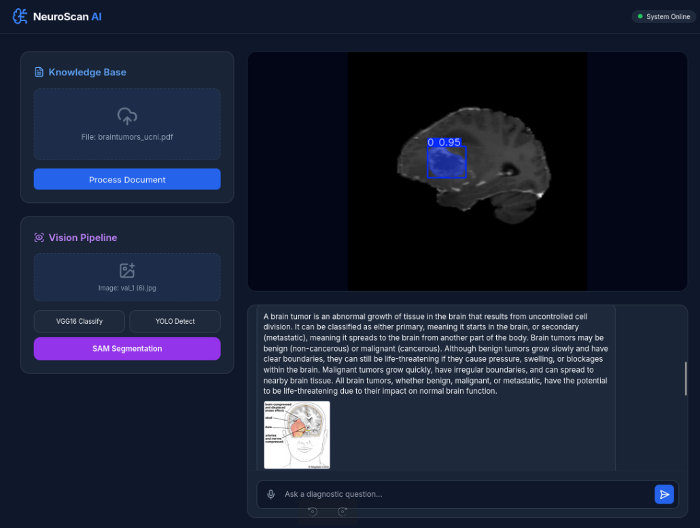

# End-To-End-Deep-Learning-Project & # AI-Medical-Assistant

---

This project implements a Deep Learning model for binary image classification.

***AI-powered medical chatbot using RAG architecture to provide accurate healthcare responses, built with LLMs, Pinecone vector database, and deployed on AWS.***

## step 1

### Clone the repository

    git clone https://github.com/Ahmed2797/End-To-End-Deep-Learning-Project.git

## step 2

### Create enverionment & install

    conda create -n tumar python=3.10 -y
    conda activate tumar

    pip install -r requirements.txt

### 📂 Download Dataset

### 1️⃣ YOLO-Ready Object Detection Dataset

* URL: [brain-tumor.zip](https://github.com/ultralytics/assets/releases/download/v0.0.0/brain-tumor.zip)

### 2️⃣ Binary Classification / Simple Detection MRI Images

* URL: [Brain MRI Images for Brain Tumor Detection](https://www.kaggle.com/datasets/navoneel/brain-mri-images-for-brain-tumor-detection)

        https://drive.google.com/file/d/1OTJ4n6I9uEL9KcOzcQgSmHvUerfwmZWI/view?usp=sharing

### Core Features ### Image Processing

* All endpoints resize images to **512x512** for faster processing.

### Frontend Features

* **Three Action Buttons:**

  1. **Predict VGG** - Shows classification result with confidence bar
  2. **Detect YOLO** - Shows image with bounding boxes around detected tumors
  3. **Segment SAM** - Shows image with precise segmentation masks

* **Image Display:**

  * Uploaded image is displayed immediately.
  * Each prediction shows the processed/annotated result image.

Multi-Modal Extraction: Uses PyMuPDF and pdfplumber to distinguish between prose, data tables, and embedded images.

Vectorized Search: Converts text and image context into 1536-dimensional embeddings using OpenAI’s text-embedding-3-small and stores them in a Pinecone serverless vector database.

Contextual Image Retrieval: When a user asks about a visual concept (e.g., "Input Projections"), the system performs a similarity search to find the corresponding image crop and serves it via a FastAPI static mount.

Interactive Frontend: A modern, responsive Tailwind CSS interface that renders AI responses in Markdown and displays retrieved PDF figures in real-time.

### Workflow

    * Browse & Show Image: Upload form displays the selected image instantly.
    * VGG16 Prediction: Returns text result with confidence percentage.
    * YOLO Detection: Returns image with green bounding boxes and confidence scores.
    * SAM Segmentation: Returns image with colored segmentation masks for easy visualization.
    * Clean UI: Updated result cards for each model type for better user experience.

    * Ingestion: The user uploads a PDF. The backend splits the document into three streams:
    * Text: Cleaned and chunked by page.
    * Tables: Converted to Markdown format to preserve structural relationships.
    * Images: Extracted as PNGs, with surrounding text saved as metadata for searchability.

## step 3

### Create a .env file in the root directory and add your Pinecone & openai credentials as follows

    PINECONE_API_KEY = "xxxxxxxxxxxxxxxxxxxxx"
    OPENAI_API_KEY = "xxxxxxxxxxxxxxxxxxxxxxx"

    run:
    python store_pincone.py
    python main.py
    python app.py

## 📬 Contact

**Author:** github.com/Ahmed2797

**Interest:** Deep Learning, Medical AI, Brain Tumor Detection
